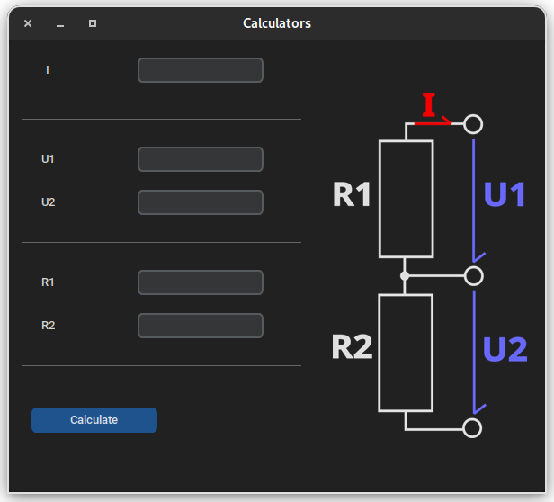
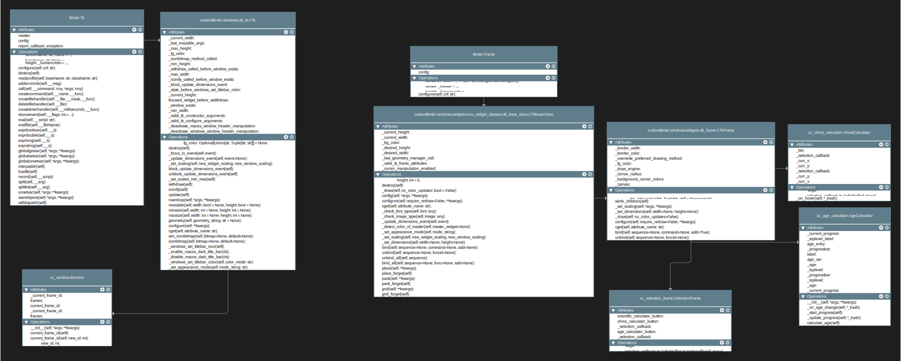
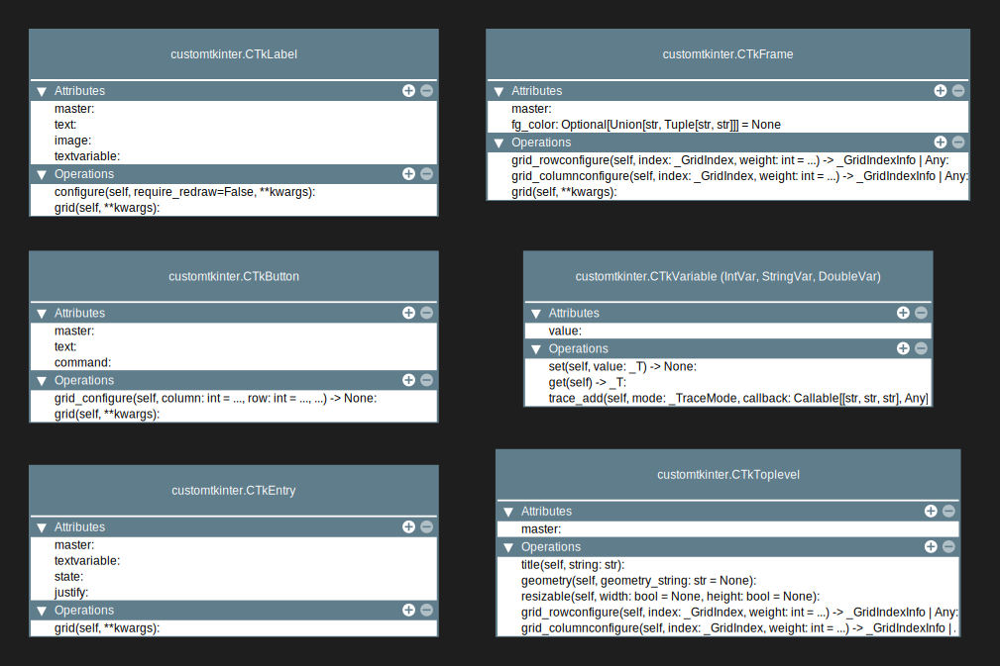

# Useless GUI

#### Why `customtkinter`?
Since I wanted the program to look good without having to create all the styles myself,
I decided to use `customtkinter`.
   

 

#### Why does this program exist?
As a part of my schools course on Object-Oriented-Programming, we had an assignment
of making the most unusable, but still working UI.

 

#### Does it work?
Yesn't

 

#### Would you use it yourself?
Absolutely not!

  

## UML-Diagrams
### Program Inheritance
The following diagram describes the inheritance as found in the program:

 

### Used Widgets
The following diagram describes all of the used Widgets with their utilized attributes and operations:

